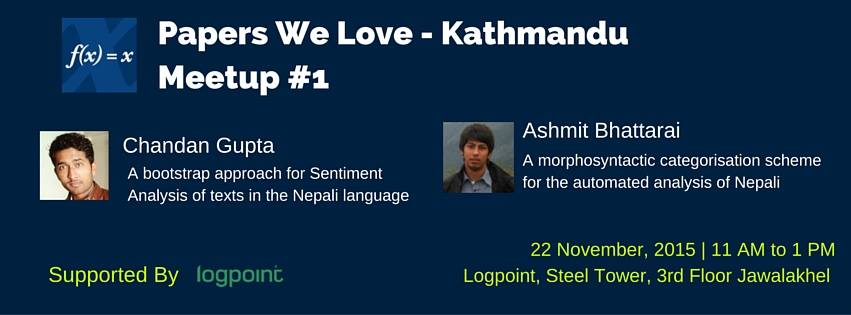

# PWL Kathmandu Meetup 01

## Event

|   event       | [fb link](https://www.facebook.com/events/744766289001751/)|
| :------------ |:-------------------------------------------- |
| Theme         | Natural Language Processing                  |
| Schedule      | Nov 22, 2015 Sunday at 11.00 AM to 12.30 AM  |
| Venue         | [LogPoint](https://www.logpoint.com) A/S Nepal, 3rd Floor, Steel Tower, Jawalakhel, Lalitpur, Nepal|

## Agenda

*  __11.00 to 11.10__ : Welcome by _Umanga Bista_
*  __11.10 to 11.30__ : Talk by _Ashmit Bhattarai_, Q/As
*  __11.30 to 12.00__ : Talk by _Chandan Gupta_, Q/As
*  __12.00 onwards__ : gathering

## Speakers

| Speakers          | Bio  | Reach  |
| :---------------- |:--------------------------------- | :-- |
| Ashmit Bhattarai  |Ashmit is currently doing research in NLP at Kathmandu university. He is also cofounder of opinio. |email: ashmit_dl AT hotmail  |
| Chandan Gupta | Chandan Goopta is cofounder of opinio and has completed Masters by Research in Computer Science at kathmandu university. His research areas is focused in NLP for Nepali language. | [twitter: @chandangoopta](https://twitter.com/chandangoopta)|

## Talks

### Ashmit Bhattarai

The discussion will revolve around POS,Parts-Of-Speech, tagging for Nepali Language, its methods,challenges and applicability.

[link]( http://www.research.lancs.ac.uk/portal/en/publications/a-morphosyntactic-categorisation-scheme-for-the-automated-analysis-of-nepali%281218355a-545a-45d5-8763-c762a615ed05%29/export.html)

> Hardie, A., Lohani, R. R., Regmi, B. N., & Yadava, Y. P. (2009). A morphosyntactic categorisation scheme for the automated analysis of Nepali. In R. Singh (Ed.), Annual Review of South Asian Languages and Linguistics 2009. (pp. 171-196). (Trends in linguistics. Studies and monographs; Vol. 222). Berlin: Mouton de Gruyter

Other details and blog post will be filled after the event.

### Chandan gupta

[Detecting Sentiment in Nepali texts: A bootstrap approach for Sentiment Analysis of texts in the Nepali language](http://goo.gl/zizq1J)

> Gupta, C.P.; Bal, B.K., "Detecting Sentiment in Nepali texts: A bootstrap approach for Sentiment Analysis of texts in the Nepali language," in Cognitive Computing and Information Processing (CCIP), 2015 International Conference on , vol., no., pp.1-4, 3-4 March 2015
doi: 10.1109/CCIP.2015.7100739

Other details and blog post will be filled after the event.
